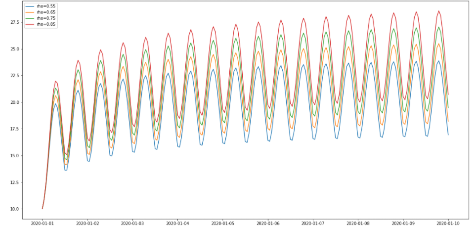
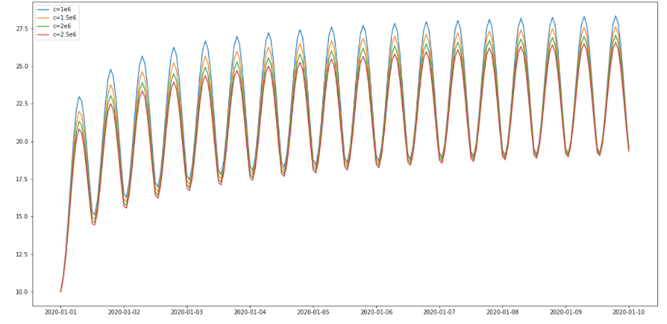

<!--
SPDX-FileCopyrightText: Contributors to the Cable Thermal Model project

SPDX-License-Identifier: MPL-2.0
-->
# The heat equation

In order to compute real-time cable temperatures the temperature model has been designed to be able to handle dynamic loads and changing environmental conditions. The foundation of these dynamic computations is the heat equation. The heat equation is a partial differential equation which completely controls heat flow in a closed system.

CTM models the temperature of cross setcions of cable circuits. Therefore we consider the 2-dimensional heat equation. In Cartesian coordinates the 2 heat equation is given by

```math
\begin{align*}
c\frac{\partial \theta}{\partial t}&=\frac{1}{\rho}\left( \frac{\partial^2\theta}{\partial x^2}+\frac{\partial^2\theta}{\partial y^2}\right) + W_{int}\\
& = \frac{1}{\rho} \Delta \theta +W_{int}\,
\end{align*}
```
where $\Delta$ denotes the Laplacian operator and

- $\theta$ is the temperature of the medium in K.
- $\rho$ is the thermal resistivity of the medium in Km/W.
- $c$ is the volumetric heat capacity of the medium in Jm<sup>3</sup>/K.
- $W_{int}$ is the internal heat generated in the medium in W/m<sup>3</sup>.

Instead of working in Cartesian coordinates, we exploit the radial symmytry of power cables and use polar coordinates instead. Using the [expression of the Laplace operator in polar coordinates](https://en.wikipedia.org/wiki/Laplace_operator#Two_dimensions), the heat equation in polar coordinates becomes

```math
c\frac{\partial \theta}{\partial t}(r, \phi) = \frac{1}{\rho r}\frac{\partial}{\partial r}\left(r\frac{\partial\theta}{\partial r}\right) + \frac{1}{\rho r^2} \frac{\partial^2\theta}{\partial \phi^2} +W_{int}\,,
```
where $\phi$ represents the angle and $r$ the distance to the origin. We furthermore assume that the solution is radially symmetric, so that the term $\frac{\partial^2\theta}{\partial \phi^2}$ vanishes. We are left with the equation
```math
c\frac{\partial \theta}{\partial t} = \frac{1}{\rho r}\frac{\partial}{\partial r}\left(r\frac{\partial\theta}{\partial r}\right) + W_{int}\,.
```
The choice of $\theta$ for the temperature is standard in the literature for power cables, where $T$ is reserved for thermal resisitance.

## Influence of parameters

The intuition behind the parameters $\rho$ and $c$ are as follows. The thermal resistivity controls how quickly heat dissipates through a medium. The volumetric heat capacity on the other hand measures how much energy needs to be added to increase the temperature of a unit volume of the material by 1 Kelvin.

We can illustrate the influence of these parameters by varying the values in a realistic setting. We plot the temperature profile of a cable carrying a cyclic load. As can be seen in the figures below __increasing thermal resistivity__ shifts the whole dynamic temperature profile __upwards__, whereas __increasing volumetric heat capacity__ stretches the dynamic temperature profile __downwards__.

### Varying thermal resistivity


### Varying thermal capacity

